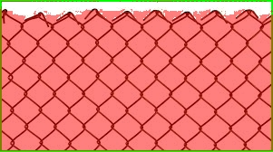
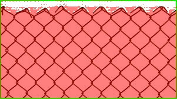

# TP1 — Setup (repo / GPU / UI)

## Dépôt
- Repo : https://github.com/selimjerbi/csc_8608.git

## Environnement d’exécution
- Exécution : nœud GPU via SLURM (cluster TSP) 

## Arborescence

## Conda + CUDA

## Dépendances

## UI Streamlit via SSH
- Port choisi : `8511`
- UI accessible via SSH tunnel : oui

## Mini-dataset d’images

- Nombre final d’images : **8**
- Sources : images récupérées via recherche web

### Images représentatives
1. `im1.jpeg` — Objet unique bien visible sur fond simple (cas simple, segmentation facile).
2. `im2.jpeg` — Objet principal complexe mais isolé (PC), bon contraste global.
3. `im4.jpeg` — Scène de rue avec plusieurs objets et arrière-plan chargé (cas complexe).
4. `im6.jpeg` — Cuisine avec de nombreux éléments et plans visuels (cas chargé).
5. `im7.jpeg` — Grillage fin et répétitif, contours difficiles à segmenter (cas difficile).

### Exemples  
- Cas simple :

- Cas difficile :

## SAM — Chargement GPU et inférence bbox → masque

- **Modèle SAM utilisé** : `vit_b`
- **Checkpoint** : `sam_vit_b_01ec64.pth`  

### Test rapide (preuve d’exécution)
Sortie console :
- device : `cuda`
- image : `im6.jpeg`
- image shape : `(189, 267, 3)` (RGB, uint8)
- mask shape : `(189, 267)`
- score : `0.893`
- mask_sum : `17515`

### Premiers constats
L’inférence fonctionne correctement : le modèle se charge sur GPU et produit un masque binaire de la même résolution que l’image d’entrée.  
Avec le modèle `vit_b`, le temps d’exécution est rapide et compatible avec une utilisation interactive via l’interface Streamlit.  
La qualité du masque dépend fortement de la bounding box fournie : une box approximative peut inclure des zones non pertinentes.  
Le mode `multimask` est utile pour les cas ambigus, mais un choix automatique du meilleur masque reste nécessaire.

## Overlay et métriques (aire, bbox, périmètre)

### Exemple d’overlay

### Métriques sur quelques images

| Image     | Score SAM | Aire (px) | Périmètre (px) |
|-----------|-----------|-----------|----------------|
| im3.jpeg  | 0.88      | 15240     | 640.5          |
| im6.jpeg  | 0.89      | 17515     | 702.1          |
| im8.jpeg  | 0.81      | 9340      | 515.7          |

### Analyse et intérêt de l’overlay

L’overlay permet de vérifier visuellement la cohérence entre la requête et la segmentation produite par SAM.  
Il aide à détecter rapidement les erreurs de cadrage : une bbox trop large inclut des régions non pertinentes, ce qui augmente artificiellement l’aire et le périmètre.  
Sur des scènes chargées ou avec faible contraste, l’overlay met en évidence les zones mal segmentées.  
Les métriques complètent l’analyse visuelle en fournissant des indicateurs quantitatifs simples pour comparer différentes images ou différents prompts.  
Ce couplage visualisation + métriques est utile pour déboguer l’UI et ajuster les interactions utilisateur avant une utilisation plus avancée.

## Mini-UI Streamlit

### Captures UI
Cas simple :

Cas difficile :

### 3 tests (UI)

| Image    | BBox (x1,y1,x2,y2) | Score | Aire (px) | Temps (ms) |
|---------|---------------------|-------|-----------|------------|
| im1.jpeg | [72,0,158,224]     | 1.002 |  15805    | 347        |
| im6.jpeg | [49,16,224,132]    | 0.908 |  12448    | 350        |
| im8.jpeg | [43,39,147,221]    | 0.980 | 0.9807    | 349        |

### Debug : effet de la taille de la bbox

Quand on agrandit la bbox, SAM dispose de plus de contexte mais peut déborder sur l’arrière-plan.  
Quand on rétrécit la bbox trop fortement, l’objet peut être tronqué : le masque devient incomplet et le score peut baisser.  
Sur les scènes chargées, une bbox large capture plusieurs objets → SAM peut segmenter la mauvaise instance.  
L’overlay est très utile pour voir immédiatement ces erreurs de cadrage : bbox mal placée, fuite du masque, ou segmentation d’un autre objet proche.

## Affinage SAM : points FG/BG + multimask

### Comparaison avant/après (2 images)

**Image 1 : im8.jpeg**
- Avant (bbox seule) :

- Après (bbox + points) :

**Image 2 : im7.jpeg**
- Avant (bbox seule) : 

- Après (bbox + points) :

### Détails des essais

**Cas 1 — im8.jpeg**
{"image":"im8.jpeg","box_xyxy":[0,0,193,259],"points":[[87,130,1]],"mask_idx":0,"score":1.0188004970550537,"time_ms":771.2609767913818,"area_px":49726,"mask_bbox":[1,0,192,259],"perimeter":901.6568541526794}

**Cas 2 — imY.jpeg**
{"image":"im7.jpeg","box_xyxy":[0,0,300,167],"points":[[150,84,1]],"mask_idx":0,"score":1.008439540863037,"time_ms":345.8595275878906,"area_px":46473,"mask_bbox":[0,1,300,166],"perimeter":1675.3940033912659}

### Analyse

Les points FG permettent de lever l’ambiguïté quand plusieurs objets sont inclus dans la bbox : SAM comprend immédiatement quel objet est visé.  
Les points BG deviennent indispensables lorsque le masque fuit vers le fond ou quand un objet parasite très proche attire la segmentation.  
Un point BG placé sur la zone à exclure force SAM à couper cette région, ce qui améliore fortement les cas avec occlusion partielle ou fond complexe.  
Malgré cela, certains cas restent difficiles : objets très fins (grillage), transparents (verre), ou faible contraste, où même FG/BG peut produire plusieurs masques plausibles.  
Dans ces situations, le multimask est utile : on peut choisir manuellement le candidat le plus cohérent visuellement, même si le score n’est pas toujours parfaitement corrélé à la meilleure segmentation.

### Bilan – Limites observées et pistes d’amélioration

Les principaux échecs de la segmentation observés sur nos images sont liés à trois facteurs.  
(1) Les fonds complexes ou texturés entraînent des fuites du masque vers l’arrière-plan, surtout avec une bbox large. L’ajout systématique de points BG et des contraintes UI sur la taille minimale/maximale de la bbox améliore nettement ces cas.  
(2) Les objets fins, transparents ou à faible contraste restent difficiles : SAM produit plusieurs masques plausibles. Un post-traitement ou un dataset dédié à ces objets aiderait.  
(3) Les ambiguïtés dans la bbox mènent à la mauvaise instance segmentée. Les points FG sont alors essentiels, et une UI guidant l’utilisateur réduit fortement ces erreurs.  
Pour passer à un usage plus robuste, il faudrait combiner guidage utilisateur, règles simples sur les métriques du masque et données d’entraînement ciblées.

### POC vers produit – Logs et monitoring prioritaires

Pour une intégration produit, il est essentiel de logger et monitorer plusieurs signaux clés.  
En priorité : 
(1) le score SAM et sa distribution dans le temps, pour détecter une baisse globale de qualité ou un drift des images.  
(2) Les métriques géométriques du masque, utiles pour repérer des masques anormalement petits ou trop larges.  
(3) Le nombre de points FG/BG utilisés par requête : une augmentation peut signaler des cas plus difficiles ou une dégradation du modèle.  
(4) Le temps d’inférence et l’usage GPU/CPU, pour détecter des régressions de performance.  
(5) Les choix multimask permettent d’identifier quand le score ne reflète pas le masque réellement pertinent.  
Ces signaux combinés permettent de détecter rapidement des régressions fonctionnelles, des changements de données d’entrée ou des problèmes de performance.

