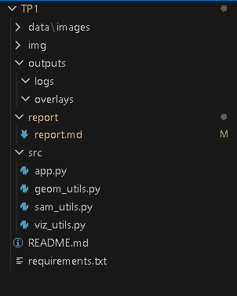
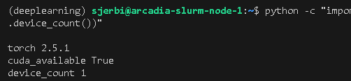
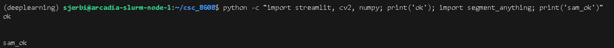
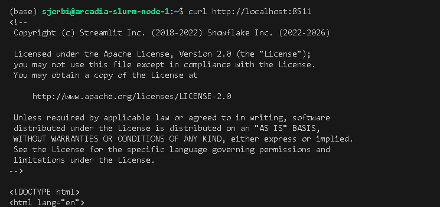
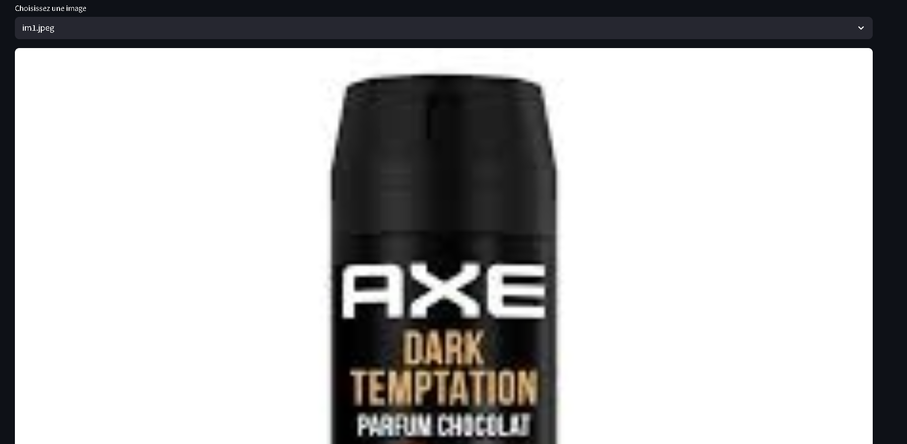
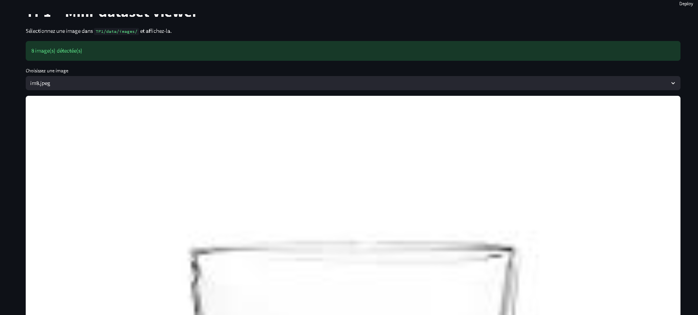
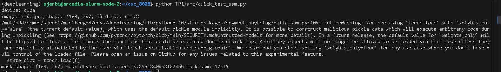
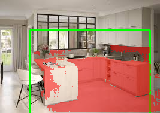
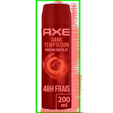
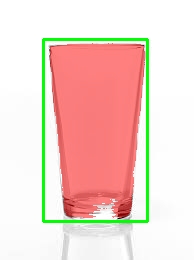

# TP1 — Setup (repo / GPU / UI)

## Dépôt
- Repo : https://github.com/selimjerbi/csc_8608.git

## Environnement d’exécution
- Exécution : nœud GPU via SLURM (cluster TSP) 

## Arborescence

## Conda + CUDA

## Dépendances

## UI Streamlit via SSH
- Port choisi : `8511`
- UI accessible via SSH tunnel : oui

## Mini-dataset d’images

- Nombre final d’images : **8**
- Sources : images récupérées via recherche web

### Images représentatives
1. `im1.jpeg` — Objet unique bien visible sur fond simple (cas simple, segmentation facile).
2. `im2.jpeg` — Objet principal complexe mais isolé (PC), bon contraste global.
3. `im4.jpeg` — Scène de rue avec plusieurs objets et arrière-plan chargé (cas complexe).
4. `im6.jpeg` — Cuisine avec de nombreux éléments et plans visuels (cas chargé).
5. `im7.jpeg` — Grillage fin et répétitif, contours difficiles à segmenter (cas difficile).

### Exemples  
- Cas simple :

- Cas difficile :

## SAM — Chargement GPU et inférence bbox → masque

- **Modèle SAM utilisé** : `vit_b`
- **Checkpoint** : `sam_vit_b_01ec64.pth`  

### Test rapide (preuve d’exécution)
Sortie console :
- device : `cuda`
- image : `im6.jpeg`
- image shape : `(189, 267, 3)` (RGB, uint8)
- mask shape : `(189, 267)`
- score : `0.893`
- mask_sum : `17515`

### Premiers constats
L’inférence fonctionne correctement : le modèle se charge sur GPU et produit un masque binaire de la même résolution que l’image d’entrée.  
Avec le modèle `vit_b`, le temps d’exécution est rapide et compatible avec une utilisation interactive via l’interface Streamlit.  
La qualité du masque dépend fortement de la bounding box fournie : une box approximative peut inclure des zones non pertinentes.  
Le mode `multimask` est utile pour les cas ambigus, mais un choix automatique du meilleur masque reste nécessaire.

## Overlay et métriques (aire, bbox, périmètre)

### Exemple d’overlay

### Métriques sur quelques images

| Image     | Score SAM | Aire (px) | Périmètre (px) |
|-----------|-----------|-----------|----------------|
| im3.jpeg  | 0.88      | 15240     | 640.5          |
| im6.jpeg  | 0.89      | 17515     | 702.1          |
| im8.jpeg  | 0.81      | 9340      | 515.7          |

### Analyse et intérêt de l’overlay

L’overlay permet de vérifier visuellement la cohérence entre la requête et la segmentation produite par SAM.  
Il aide à détecter rapidement les erreurs de cadrage : une bbox trop large inclut des régions non pertinentes, ce qui augmente artificiellement l’aire et le périmètre.  
Sur des scènes chargées ou avec faible contraste, l’overlay met en évidence les zones mal segmentées.  
Les métriques complètent l’analyse visuelle en fournissant des indicateurs quantitatifs simples pour comparer différentes images ou différents prompts.  
Ce couplage visualisation + métriques est utile pour déboguer l’UI et ajuster les interactions utilisateur avant une utilisation plus avancée.

## Mini-UI Streamlit

### Captures UI
Cas simple :

Cas difficile :

### 3 tests (UI)

| Image    | BBox (x1,y1,x2,y2) | Score | Aire (px) | Temps (ms) |
|---------|---------------------|-------|-----------|------------|
| im1.jpeg | [72,0,158,224]     | 1.002 |  15805    | 347        |
| im6.jpeg | [49,16,224,132]    | 0.908 |  12448    | 350        |
| im8.jpeg | [43,39,147,221]    | 0.980 | 0.9807    | 349        |

### Debug : effet de la taille de la bbox

Quand on agrandit la bbox, SAM dispose de plus de contexte mais peut déborder sur l’arrière-plan.  
Quand on rétrécit la bbox trop fortement, l’objet peut être tronqué : le masque devient incomplet et le score peut baisser.  
Sur les scènes chargées, une bbox large capture plusieurs objets → SAM peut segmenter la mauvaise instance.  
L’overlay est très utile pour voir immédiatement ces erreurs de cadrage : bbox mal placée, fuite du masque, ou segmentation d’un autre objet proche.

