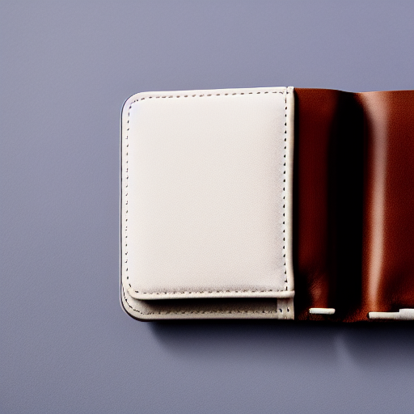
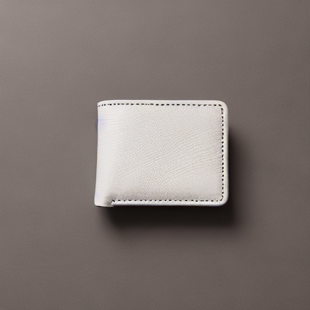
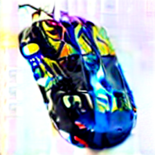
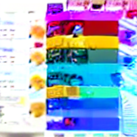
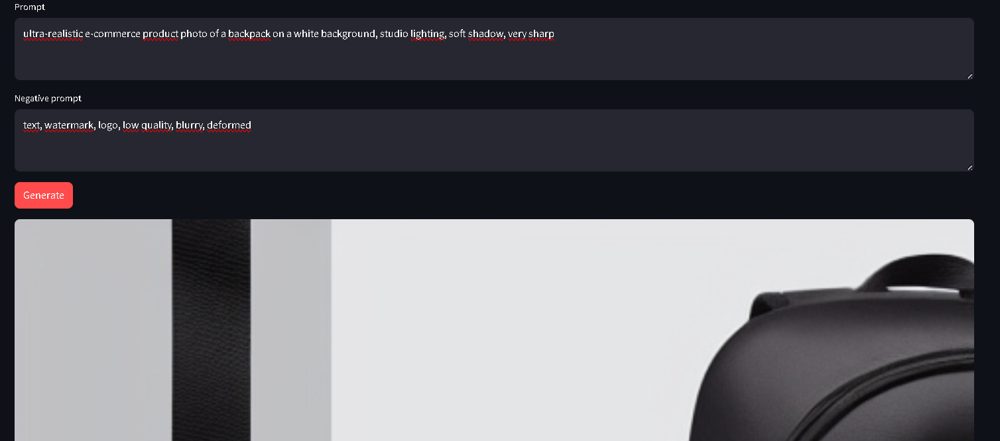
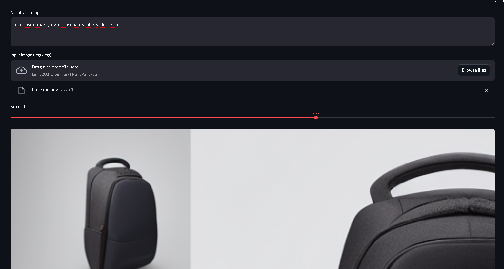
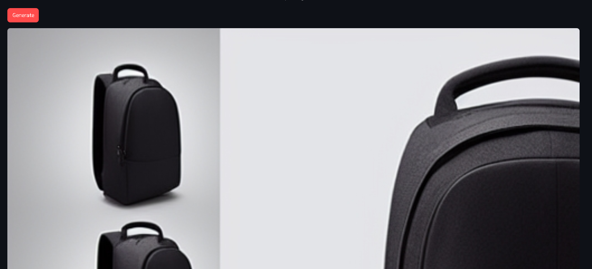

## TP2 — Smoke test Diffusers (Stable Diffusion v1.5)

### Image générée (smoke test)

## TP2 — Pipeline factorisé (text2img / img2img)

### Baseline text2img

Configuration utilisée :
CONFIG: {'model_id': 'stable-diffusion-v1-5/stable-diffusion-v1-5', 'scheduler': 'EulerA', 'seed': 42, 'steps': 30, 'guidance': 7.5}

## TP2 — Expériences contrôlées (steps, guidance, scheduler)

Prompt (constant) : *ultra-realistic e-commerce product photo of a minimalist leather wallet on a clean white background, studio lighting, soft shadow, very sharp, 50mm lens*  
Seed (constant) : 42

### Résultats (6 runs)

| Run                                                      | Image                                  |
|----------------------------------------------------------|----------------------------------------|
| Run01 baseline (EulerA, steps=30, guidance=7.5)          |  |
| Run02 steps bas (EulerA, steps=15, guidance=7.5)         |   |
| Run03 steps haut (EulerA, steps=50, guidance=7.5)        |   |
| Run04 guidance bas (EulerA, steps=30, guidance=4.0)      |     |
| Run05 guidance haut (EulerA, steps=30, guidance=12.0)    |    |
| Run06 scheduler différent (DDIM, steps=30, guidance=7.5) |      |

### Analyse qualitative (sans métrique)

- **Effet de `num_inference_steps`** :  
  - À **15 steps**, l’image converge moins : détails plus approximatifs, texture/contours parfois moins nets.  
  - À **50 steps**, on observe souvent plus de détails et une meilleure définition, mais le gain peut être marginal par rapport à 30 steps.

- **Effet de `guidance_scale`** :  
  - À **guidance=4.0**, l’image suit moins strictement le prompt : rendu parfois plus libre/moins fidèle, mais peut paraître plus naturel.  
  - À **guidance=12.0**, l’image colle plus au prompt mais peut devenir plus “forcée” : artefacts, rendu trop contrasté ou détails artificiels selon les cas.

- **Effet du scheduler** :  
  - Changer EulerA → DDIM modifie le style de convergence.  
  - À paramètres identiques (steps/guidance/seed), la composition globale reste proche, mais le rendu peut varier sensiblement.

## TP2 — Img2Img : effet du paramètre strength 

Image source (avant) :

Résultats :
- strength = 0.35  

- strength = 0.60  

- strength = 0.85  

### Analyse qualitative

- **Ce qui est conservé (structure / identité)** :
  - À strength=0.35, la forme globale et le cadrage restent proches de l’image source ; le modèle retouche plus qu’il ne transforme.
  - À strength=0.60, l’identité produit est souvent encore reconnaissable, mais certains éléments peuvent changer.

- **Ce qui change (textures / fond / lumière / détails)** :
  - En augmentant strength, les textures deviennent plus générées, l’éclairage et les ombres peuvent être réinterprétés.
  - À strength=0.85, le fond et les détails peuvent être largement réinventés : le modèle s’éloigne fortement de l’image d’entrée.

- **Utilisabilité e-commerce** :
  - strength faible/moyen est généralement préférable pour rester fidèle au produit réel.
  - strength élevé (0.85) peut produire un rendu visuellement attractif mais trop loin du produit original : risque de modifier la forme, le matériau ou des caractéristiques importantes.

## TP2 — Mini-produit Streamlit (MVP)

L’application Streamlit permet :
- mode **Text2Img** (prompt → image),
- mode **Img2Img** (image + prompt → image),
- contrôle des paramètres : seed, steps, guidance, scheduler, et strength (img2img),
- affichage d’un bloc **Config** pour reproductibilité.

### Captures
- **Text2Img** : 

- **Img2Img** : 

