## TP3 — Sanity check environnement

Le script `sanity_check.py` valide :
- la disponibilité des librairies (torch, torchaudio, transformers, datasets),
- la détection automatique du device (CPU/GPU),
- le bon fonctionnement de torchaudio via génération d’un signal 1 seconde et calcul d’un log-Mel spectrogram.

### Résultat (capture terminal)

## TP3 — Mini-jeu de données : enregistrement + vérification audio

J’ai enregistré un court “appel” (~60s) en anglais et sauvegardé le fichier sous `TP3/data/call_01.wav` (WAV mono, 16 kHz).

### Métadonnées (durée / sample rate / canaux)

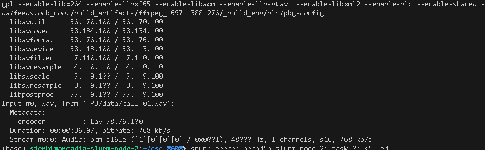

### Inspection torchaudio (shape, durée, RMS, clipping)

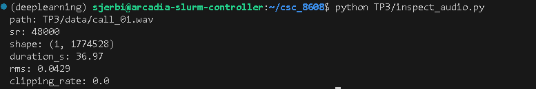

## TP3 — VAD (silero) : segmentation parole / silence

### Résultat VAD (stats) & Extrait JSON (5 segments)

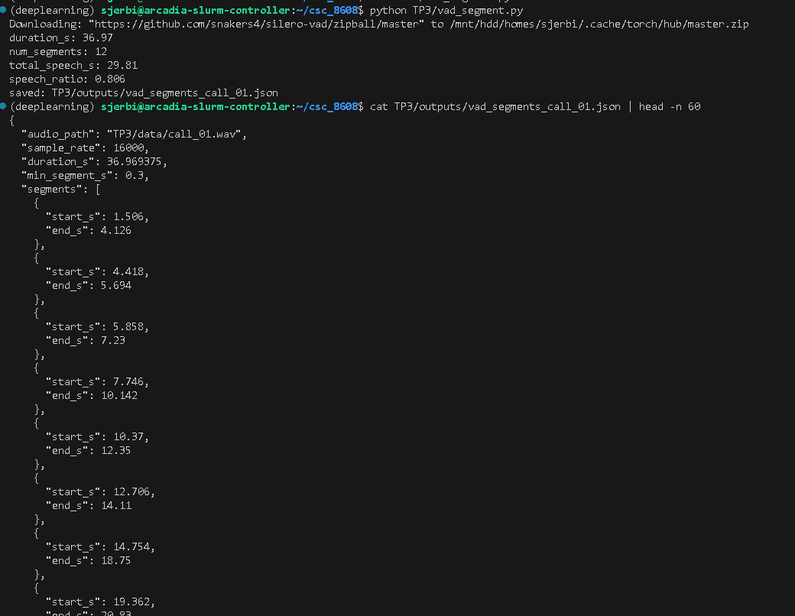

### Analyse rapide (2–4 lignes)
Le ratio speech/silence est cohérent avec une lecture à voix claire avec des pauses naturelles (respiration, ponctuation). On observe plusieurs segments correspondant à des phrases séparées par de courts silences.

### Effet du filtrage min_dur_s
En passant de 0.30 à 0.60, num_segments diminue (suppression des segments très courts) et le speech_ratio reste proche / baisse légèrement selon les micro-pauses détectées.

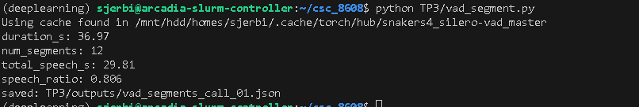

## TP3 — ASR Whisper (segments VAD) + latence

### Exécution

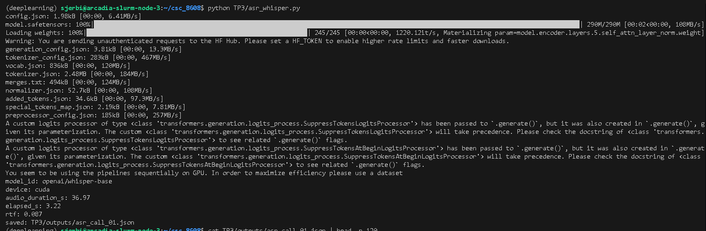

### Extrait JSON (5 segments)

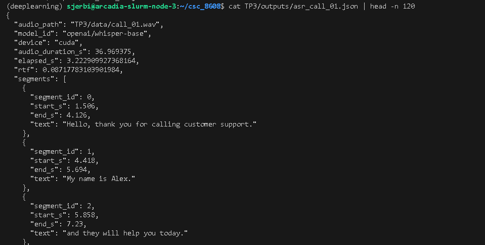

La segmentation VAD aide globalement la transcription en évitant de traiter les silences et en réduisant le risque de “dérive” de Whisper sur de longues pauses. En revanche, elle peut gêner si un segment coupe un mot ou une phrase, ce qui peut dégrader la ponctuation implicite et la cohérence. Globalement, sur une lecture continue, le gain en latence est intéressant, mais il faut idéalement lisser les segments

## TP3 — Call center analytics : PII + intention

### Run 1 (heuristiques simples)

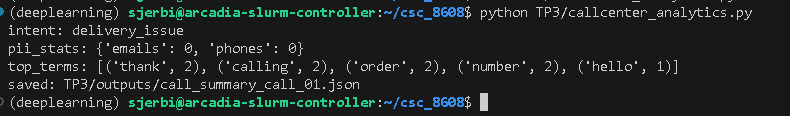

### Run 2 (post-traitement pragmatique PII “spoken/spelled”)

Après ajout du post-traitement, la redaction est plus robuste.

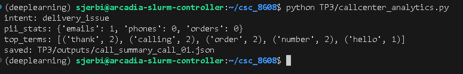

Observation : le masquage de l’order id et des numéros “épelés” est mieux géré ; en contrepartie, ces règles peuvent produire des faux positifs hors contexte call-center.

## TP3 — TTS agent reply + latence

### Génération TTS (stats)

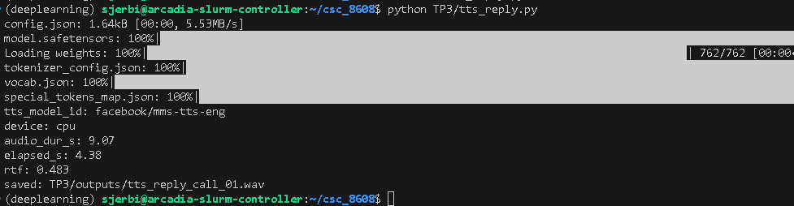

### Métadonnées WAV

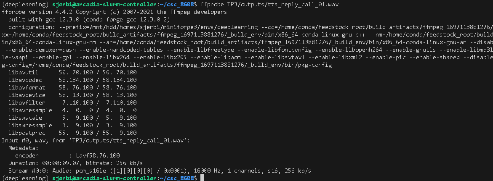

### Qualité (4–6 lignes)
Observation TTS : la voix est globalement intelligible et le message est compréhensible. 
La prosodie est correcte mais un peu robotique. 
Aucun artefact majeur ou bruit notable sur ce run. 
Le RTF indique une latence cohérente.

### ASR check (intelligibilité)

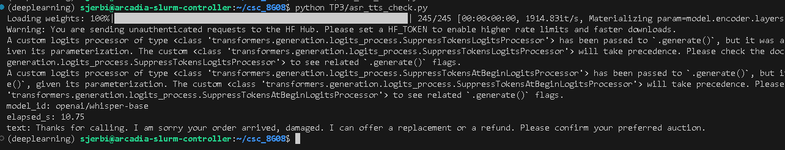

Comparaison grossière : la transcription Whisper reprend l’essentiel du message.

## TP3 — Pipeline end-to-end (VAD → ASR → Analytics → TTS)

### Exécution

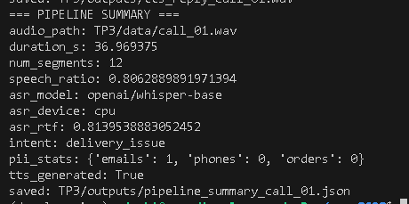

### pipeline_summary_call_01.json

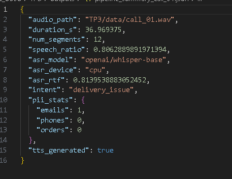

### Engineering note (8–12 lignes)
Le goulet d’étranglement principal est l’étape ASR Whisper, car elle exécute un modèle lourd sur plusieurs segments.
L’étape la plus fragile est le couple VAD+ASR : si le VAD coupe trop court, Whisper peut tronquer des mots, perdre de la ponctuation implicite et dégrader la cohérence du transcript final.
Deux améliorations produit sans entraînement : 
(1) ajouter un padding autour des segments VAD  et fusionner les segments trop proches pour limiter les coupures 
(2) ajouter un post-traitement robuste du transcript + logging systématique pour détecter régressions et cas extrêmes.

