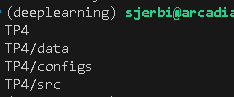
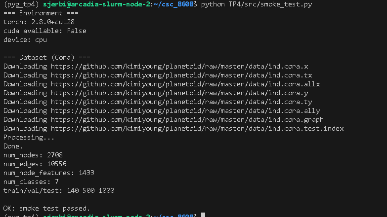
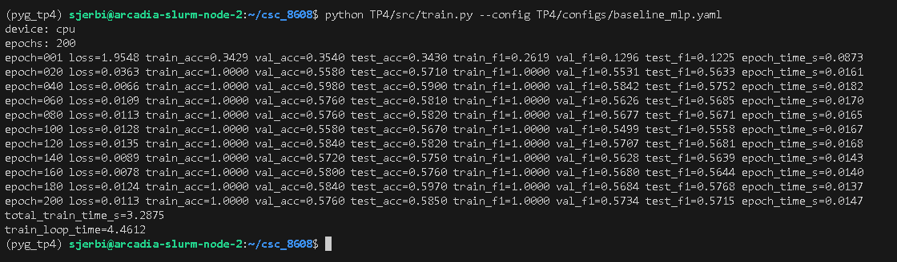
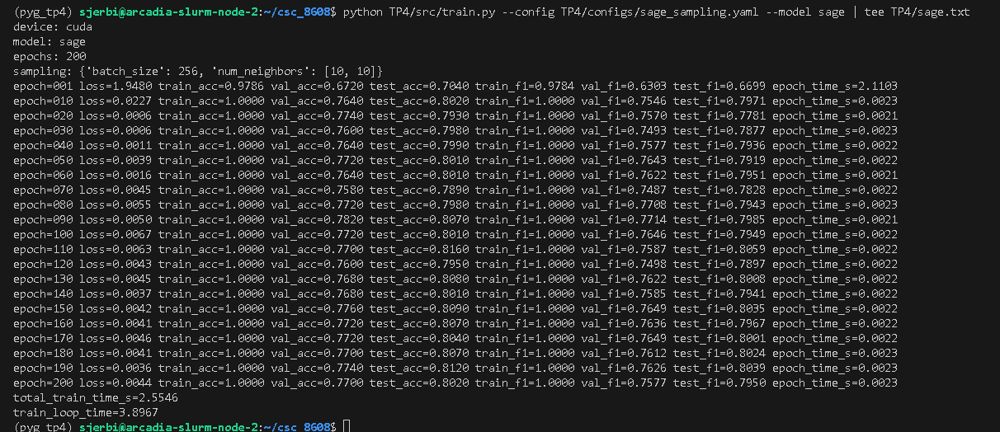
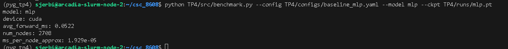
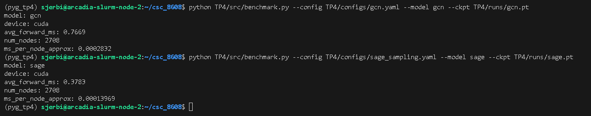

# TP4-Deep learning pour audio

## Structure

## Smoke test PyG (Cora)

## Baseline tabulaire : MLP (features seules)

### Configuration utilisée

### Pourquoi des métriques séparées train/val/test (4–6 lignes)

On évalue séparément sur train_mask, val_mask et test_mask car ce sont trois sous-ensembles avec des rôles différents.
train_mask mesure ce que le modèle apprend sur les données utilisées pour optimiser les poids.
val_mask sert à surveiller la généralisation pendant l’entraînement.
test_mask est gardé “à part” pour donner une estimation finale non biaisée des performances, une fois les choix de modèle/hyperparamètres fixés.
Mélanger ces ensembles ferait fuiter de l’information et surestimerait les performances réelles.

## Baseline GNN : GCN (full-batch) + comparaison perf/temps

### Configurations utilisées

**MLP**
- config: `TP4/configs/baseline_mlp.yaml`
- epochs: 200

**GCN**
- config: `TP4/configs/gcn.yaml`
- epochs: 200

### Extrait terminal — MLP (début + intermédiaire + fin)

device: cpu
model: mlp
epochs: 200
epoch=001 loss=1.9548 train_acc=0.3429 val_acc=0.3540 test_acc=0.3430 train_f1=0.2619 val_f1=0.1296 test_f1=0.1225 epoch_time_s=0.0129
epoch=100 loss=0.0128 train_acc=1.0000 val_acc=0.5580 test_acc=0.5670 train_f1=1.0000 val_f1=0.5499 test_f1=0.5558 epoch_time_s=0.0097
epoch=200 loss=0.0113 train_acc=1.0000 val_acc=0.5760 test_acc=0.5850 train_f1=1.0000 val_f1=0.5734 test_f1=0.5715 epoch_time_s=0.0094
total_train_time_s=1.9895
train_loop_time=2.7514

### Extrait terminal — GCN (début + intermédiaire + fin)
device: cpu
model: gcn
epochs: 200
epoch=001 loss=1.9582 train_acc=0.8357 val_acc=0.4660 test_acc=0.4670 train_f1=0.8334 val_f1=0.4846 test_f1=0.4749 epoch_time_s=0.0261
epoch=100 loss=0.0137 train_acc=1.0000 val_acc=0.7740 test_acc=0.8130 train_f1=1.0000 val_f1=0.7547 test_f1=0.8048 epoch_time_s=0.0205
epoch=200 loss=0.0089 train_acc=1.0000 val_acc=0.7740 test_acc=0.8020 train_f1=1.0000 val_f1=0.7581 test_f1=0.7942 epoch_time_s=0.0216
total_train_time_s=4.4195
train_loop_time=6.4051

### Comparaison (MLP vs GCN)
| Modèle                | test_acc | test_f1 (macro) | total_train_time_s |
| --------------------- | -------: | --------------: | -----------------: |
| MLP (features seules) |   0.5850 |          0.5715 |             1.9895 |
| GCN (full-batch)      |   0.8020 |          0.7942 |             4.4195 |

## Explication (6–10 lignes) : pourquoi GCN dépasse le MLP sur Cora ?

Sur Cora, le graphe apporte un signal structurel utile : les nœuds connectés ont souvent la même classe.
Le MLP ne voit que les features x d’un nœud, donc il ne peut pas exploiter l’information “qui est voisin de qui”.
GCN, via l’agrégation de voisinage, combine les features locales avec celles des voisins et peut ainsi renforcer le signal de classe et réduire le bruit.
Cela explique le gain net en Accuracy et en Macro-F1.
Le coût temporel augmente car chaque forward/backward GCN effectue des opérations supplémentaires sur edge_index.
Enfin, sur ce TP, on reste loin du sur-lissage ; avec plus de couches, on pourrait au contraire dégrader les performances.

## Modèle principal : GraphSAGE + neighbor sampling (mini-batch)

### Configuration (GraphSAGE + sampling)

### Compromis “neighbor sampling” (8–12 lignes)

Neighbor sampling accélère l’entraînement car on ne propage pas les messages sur tout le graphe à chaque itération :
pour chaque mini-batch de nœuds “seed”, on échantillonne seulement un sous-graphe local.
Le coût mémoire et le coût de calcul deviennent donc ~proportionnels au nombre de nœuds/voisins échantillonnés, au lieu d’être liés à tout E.
En contrepartie, le gradient est estimé sur un sous-graphe aléatoire : c’est un estimateur bruité, ce qui peut rendre l’optimisation moins stable.
Le choix du fanout ([10,10]) et du batch_size contrôle ce compromis : plus grand = meilleure approximation mais plus cher.
Il existe aussi un biais potentiel si le sampling ignore des voisins importants ou si la distribution des voisins est très hétérogène.

## Benchmarks ingénieur : temps d’entraînement et latence d’inférence (CPU/GPU)

### Comparaison finale : performances et coûts (Cora)

| Modèle   | test_acc | test_f1 (macro) | total_train_time_s | avg_forward_ms (GPU) |
|----------|----------|-----------------|--------------------|----------------------|
| MLP      | 0.5850   | 0.5715          | 1.9895             | 0.0522               |
| GCN      | 0.8020   | 0.7942          | 4.4195             | 0.7669               |
| GraphSAGE| 0.8020   | 0.7950          | 2.5546             | 0.3783               |

### Benchmark latence d’inférence (forward)

### Pourquoi warmup + synchronisation CUDA 

Sur GPU, l’exécution des kernels CUDA est asynchrone : l’appel Python retourne souvent avant la fin réelle du calcul.
Sans synchronisation, on mesurerait surtout le coût de lancement des kernels et on sous-estimerait le temps réel du forward.
Le warmup est nécessaire car les premières itérations incluent des surcoûts, ce qui rend les mesures instables.
En faisant plusieurs itérations de warmup, on atteint un régime “steady state” plus représentatif.
On synchronise CUDA avant de démarrer le timer pour s’assurer que le GPU est idle, puis après le forward pour attendre la fin complète du calcul.
Ainsi, la latence mesurée correspond réellement au temps de calcul du forward et devient comparable entre modèles.

## Synthèse finale : comparaison, compromis et recommandations ingénieur

### Tableau comparatif

| Modèle      | test_acc | test_macro_f1 | total_train_time_s | train_loop_time | avg_forward_ms |
|------------|----------|---------------|--------------------|----------------|----------------|
| MLP        | 0.5850   | 0.5715        | 1.9895             | 2.7514         | 0.0522         |
| GCN        | 0.8020   | 0.7942        | 4.4195             | 6.4051         | 0.7669         |
| GraphSAGE  | 0.8020   | 0.7950        | 2.5546             | 3.8967         | 0.3783         |

## Recommandation ingénieur

Si la contrainte principale est la latence d’inférence, le MLP est le plus rapide, mais sa qualité est nettement inférieure.  
Le GCN offre la meilleure amélioration en précision par rapport au MLP, mais au prix d’un coût plus élevé : temps d’entraînement doublé et latence 15× plus grande.  
GraphSAGE atteint des performances comparables au GCN tout en réduisant significativement les coûts.  
Ainsi :
- **MLP** : adapté si la structure du graphe n’est pas exploitable ou si la latence est ultra-critique.
- **GCN** : pertinent si la priorité absolue est la qualité et que le graphe tient en mémoire.
- **GraphSAGE** : meilleur compromis ingénieur qualité / coût, surtout pour des graphes plus grands où le sampling devient crucial.

Dans ce TP, GraphSAGE apparaît comme le choix le plus équilibré.

## Risque de protocole et bonnes pratiques

Un risque important est la non-comparabilité des conditions d’exécution, ce qui peut biaiser fortement les mesures de latence.  
De plus, l’utilisation d’une seule seed peut introduire de la variance non observée entre modèles.  
Un autre risque est le data leakage si les masques train/val/test sont mal utilisés.  
Enfin, comparer un modèle entraîné en mini-batch à un autre en full-batch peut introduire un biais si les hyperparamètres ne sont pas harmonisés.  
Dans un vrai projet, on utiliserait :
- plusieurs seeds et une moyenne ± écart-type,
- un protocole strict CPU ou strict GPU pour tous les modèles,
- des mesures répétées stabilisées,
- un suivi automatique des expériences.
