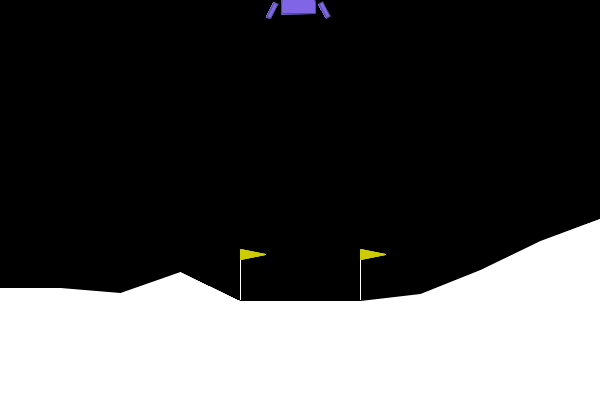
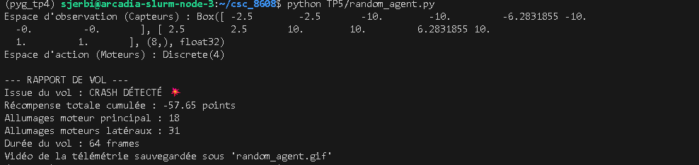
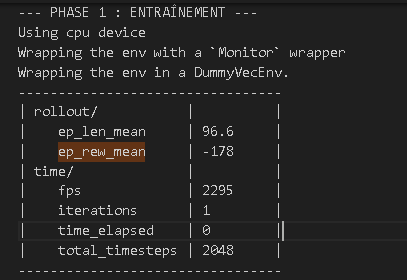
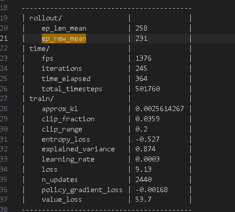
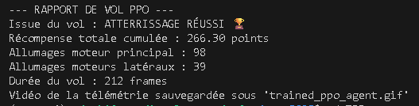
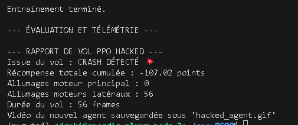
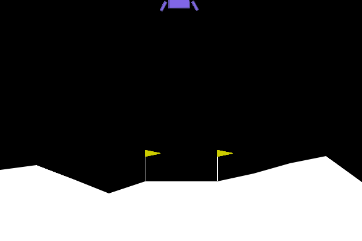

# TP5 — Comprendre la Matrice et Instrumenter l’Environnement (Gymnasium)

## 1) Script random_agent.py
Objectif : initialiser LunarLander-v3, faire agir un agent aléatoire, enregistrer une vidéo (GIF) et calculer des métriques de vol (score total, usage moteurs, issue).

## 2) GIF de la simulation

## 3) Rapport de vol (sortie terminal)

## Distance à la résolution (+200)

Score obtenu par l’agent aléatoire (1 épisode) : −57.65 points.

Un agent est considéré comme “résolvant” l’environnement s’il atteint en moyenne +200 points.

Écart au seuil :
200 − (−57.65) = 257.65 points.

L’agent aléatoire est donc très loin de la performance requise. 
Il ne possède aucune stratégie de stabilisation, gaspille du carburant, et finit généralement par un crash.
Cela confirme que LunarLander nécessite un apprentissage structuré pour être résolu.

## TP5 — PPO (Stable-Baselines3) : Entraînement + Évaluation

### Évolution de `ep_rew_mean` pendant l’entraînement
Pendant l’entraînement PPO (500 000 timesteps), j’ai observé la métrique `ep_rew_mean` dans les logs :

- Au début : `ep_rew_mean` :

- À la fin : `ep_rew_mean` : 

=> `ep_rew_mean` augmente nettement entre le début et la fin, ce qui indique que l’agent améliore sa politique au fil de l’apprentissage.

### GIF de l’agent PPO entraîné

### Rapport de vol PPO (sortie terminal)

### Comparaison avec l’agent aléatoire (carburant + issue)
### Comparaison carburant et issue du vol
🔹 Agent aléatoire
        Issue : CRASH 💥
        Score total : −57.65
        Allumages moteur principal : 18
        Allumages moteurs latéraux : 31
        Durée du vol : 64 frames

L’agent agit sans stratégie : il consomme du carburant de manière incohérente et finit rapidement par s’écraser.

🔹 Agent PPO entraîné
        Issue : ATTERRISSAGE RÉUSSI 🏆
        Score total : 266.30
        Allumages moteur principal : 98
        Allumages moteurs latéraux : 39
        Durée du vol : 212 frames

L’agent PPO utilise davantage le moteur principal, mais de manière stratégique pour contrôler sa descente et stabiliser l’atterrissage.
L’utilisation des moteurs latéraux est plus mesurée et sert au contrôle d’orientation.

### Analyse comparative

L’agent aléatoire utilise peu de carburant car il crash rapidement.
PPO consomme plus de carburant, mais pour maintenir le contrôle et optimiser la trajectoire.
La durée de vol est plus longue avec PPO, indiquant un pilotage stabilisé.
La stratégie PPO maximise la récompense au lieu d’agir au hasard.

### Seuil de résolution (+200)

Un agent résout l’environnement si le score moyen ≥ +200.
Score PPO : 266.30
ep_rew_mean final : ≈ 231
Oui, l’agent PPO dépasse largement le seuil de +200 points et résout l’environnement.

## Reward Engineering : Wrapper + Reward Hacking

### Preuve d’exécution

### Stratégie observée (description)

En observant hacked_agent.gif et les métriques, l’agent adopte une stratégie visant à éviter l’allumage du moteur principal.
Il privilégie alors des actions moins pénalisées, quitte à perdre le contrôle et à échouer l’atterrissage.
Le comportement est “aberrant” du point de vue humain, mais cohérent avec la récompense modifiée.

### Pourquoi c’est optimal (explication math/logique)

L’agent PPO maximise l’espérance de la somme des récompenses :

\[
J(\pi) = \mathbb{E}_{\pi} \left[ \sum_{t=0}^{T} \gamma^t \, r_t \right]
\]

où :

- \( \pi \) est la politique,
- \( r_t \) est la récompense à l’instant \( t \),
- \( \gamma \in [0,1] \) est le facteur de discount,
- \( T \) est l’horizon de l’épisode.

Avec notre wrapper, chaque action 2 (moteur principal) ajoute une pénalité forte : 
\[
r'_t = r_t - 50 \cdot \mathbf{1}_{\{a_t = 2\}}
\]

Cette pénalité domine les termes de récompense “normaux”  et peut rendre toute trajectoire utilisant le moteur principal très défavorable.
Ainsi, une politique qui évite l’action 2 peut maximiser 
J(π) même si elle conduit à un crash, car elle supprime les pertes massives liées à la pénalité.
C’est un exemple de “reward hacking” : l’agent optimise exactement la fonction objectif qu’on lui donne, pas l’intention réelle.