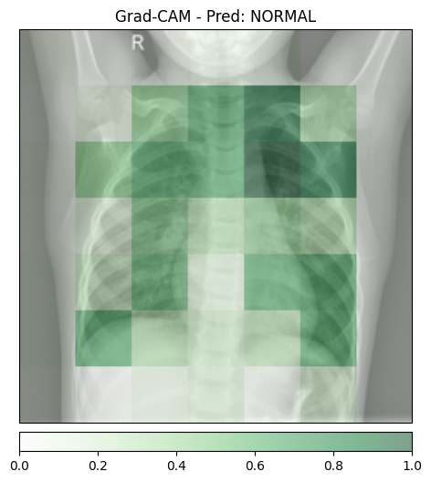
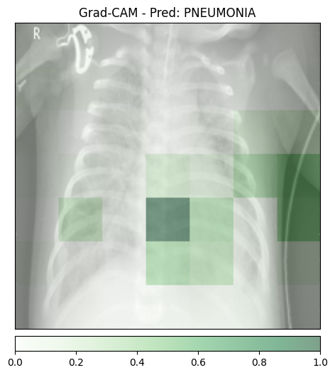
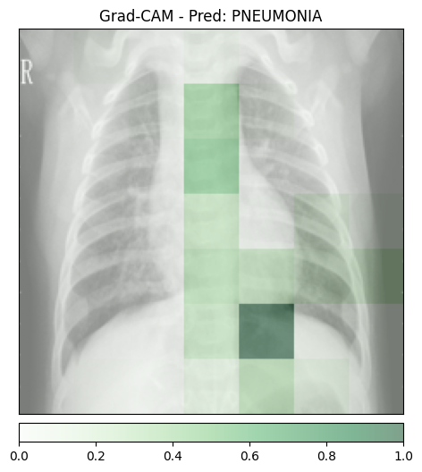
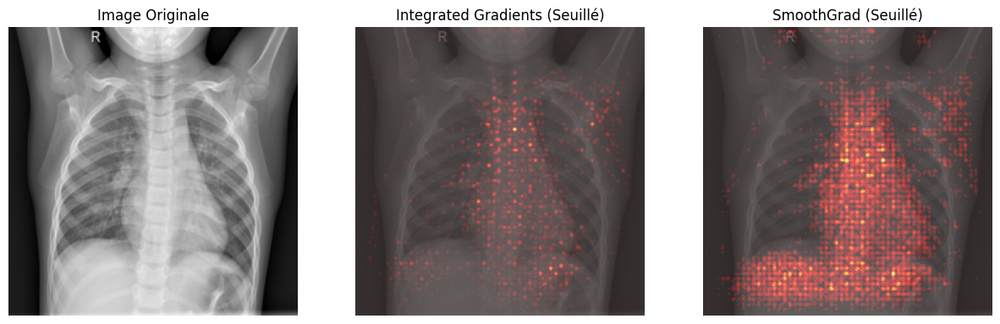
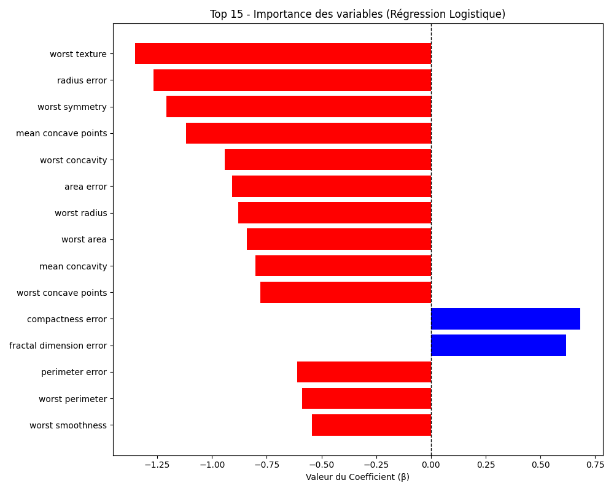
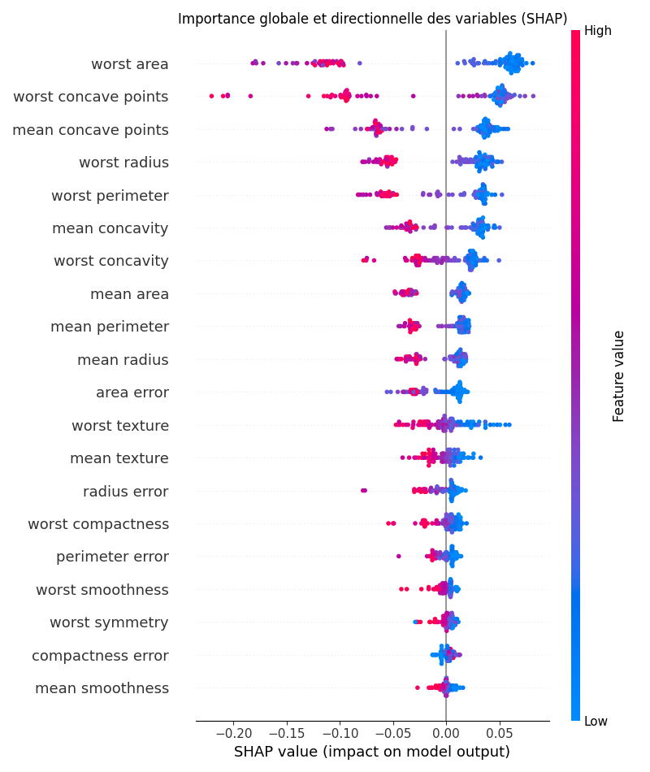
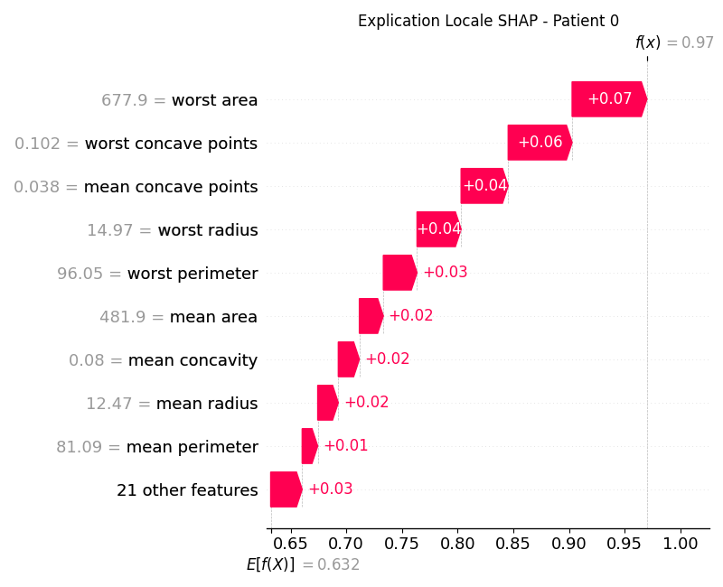

# TP6 — Mise en place, Inférence et Grad-CAM

## Grad-CAM (images générées)

### normal_1

### pneumo_1

### pneumo_2 (optionnel)

## Analyse des faux positifs (Clever Hans)
Dans mes résultats, l’image saine affichée ici est prédite NORMAL, donc je n’observe pas de faux positif sur cet exemple précis.  
En revanche, on remarque que les zones mises en évidence par Grad-CAM se situent majoritairement dans la région thoracique, et pas sur des artefacts évident. 
Cela suggère que le modèle s’appuie plutôt sur du contenu anatomique que sur un biais “Clever Hans” clair, même si l’explication reste grossière.

## Granularité (blocs flous) et origine de la perte de résolution
Les cartes Grad-CAM apparaissent sous forme de gros blocs peu précis.  
C’est attendu car Grad-CAM est calculé sur la dernière couche convolutionnelle d’un ResNet, où la résolution spatiale a été fortement réduite par les strides / pooling (downsampling successifs).  
On obtient donc une carte d’activation de petite taille, ensuite interpolée à la taille de l’image : cette interpolation produit une heatmap “pixelisée” et non une localisation fine au niveau des détails pulmonaires.

## Integrated Gradients + SmoothGrad

### Visualisation comparative

### Temps d'exécution
- Temps inférence : **[0.0192s]**
- Temps IG pur : **[0.9969s]**
- Temps SmoothGrad (IG x 100) : **[14.1389s]**

SmoothGrad est beaucoup plus coûteux qu’une inférence classique.  
Donc, ce n’est pas réaliste de le faire en synchrone “temps réel” au premier clic.

Architecture proposée:  
envoyer la demande d’explication dans une file (queue) vers un worker GPU asynchrone, puis afficher le résultat dès qu’il est prêt (callback / polling).

### Intérêt d’une carte signée (valeurs < 0)
Contrairement à Grad-CAM (ReLU, uniquement contributions positives), Integrated Gradients peut produire des valeurs positives et négatives :  
- positif = pixels qui poussent vers la classe prédite  
- négatif = pixels qui la pénalisent  
Mathématiquement, garder le signe donne une information plus riche (direction de l’influence) qu’un filtre ReLU qui supprime toute contribution négative.

## Modélisation intrinsèquement interprétable — Régression Logistique

### Importance des variables

### Feature la plus impactante vers "Maligne" (classe 0)

En observant le graphique, la caractéristique ayant le coefficient négatif le plus élevé en valeur absolue est worst texture  
C’est donc la variable qui pousse le plus fortement la prédiction vers la classe Maligne (0) dans ce modèle.

### Avantage d’un modèle directement interprétable

L’avantage d’un modèle intrinsèquement interprétable est que son explication provient directement de ses paramètres (ici les coefficients β), sans dépendre d’une méthode post-hoc approximative pouvant varier selon la technique d’explicabilité utilisée.

## Explicabilité Post-Hoc (SHAP) — Random Forest

### Explicabilité Globale

Les variables les plus importantes selon le Random Forest (SHAP) sont :

- **worst area**
- **worst concave points**
- **mean concave points**
- **worst radius**

Dans l’exercice précédent, des variables liées à la géométrie tumorale ressortaient déjà fortement.

On observe donc une cohérence importante entre les deux modèles :  
les caractéristiques liées à la taille, la concavité et la forme de la tumeur dominent dans les deux approches.

Cela suggère que ces variables constituent des biomarqueurs robustes, informatifs indépendamment du type de modèle (linéaire ou non-linéaire).

### Explicabilité Locale (Patient 0)

Pour le patient 0, la caractéristique ayant le plus contribué à tirer la prédiction vers sa valeur finale est : worst area

La valeur numérique exacte de cette caractéristique pour ce patient est indiquée sur le graphique waterfall.

Cette forte contribution indique que la surface maximale observée de la tumeur est le facteur principal ayant influencé la décision du modèle pour ce patient.

### Conclusion

La comparaison entre un modèle linéaire (Glass-box) et un modèle complexe (Random Forest + SHAP) montre que certaines variables cliniques restent dominantes dans les deux cas. Cela renforce leur crédibilité en tant que biomarqueurs fiables.